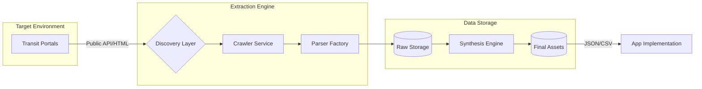
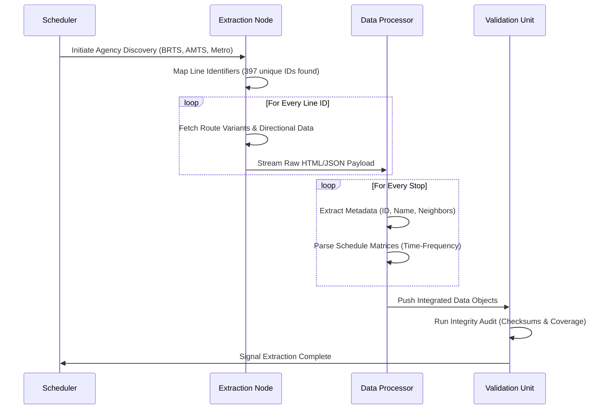
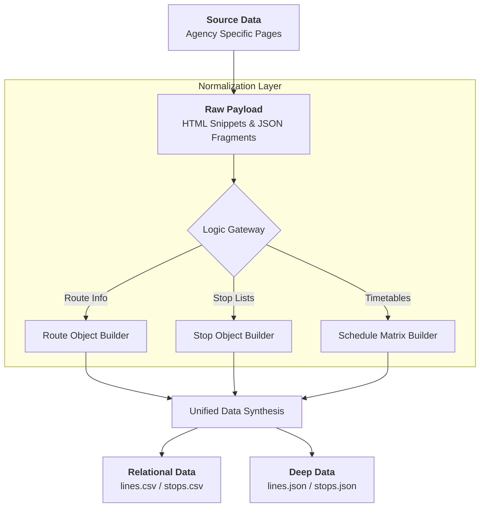

# 🚇 Ahmedabad Unified Transit Dataset (2026)

A high-fidelity, production-grade extraction of Ahmedabad’s transit network, covering **BRTS (Janmarg)**, **AMTS**, and the **Ahmedabad Metro**. This dataset provides the backbone for routing engines, schedule trackers, and urban planning simulations.

---

## 📊 Dataset Snapshot

| Metric | Detail |
| :--- | :--- |
| **Total Lines** | 397 (Variants included) |
| **Total Stops** | 4,739 Unique Records |
| **Agencies** | BRTS, AMTS, Metro, GSRTC |
| **Data Format** | JSON (Deep), CSV (Relational) |
| **Integrity** | 99.94% Field Completion |

---

## 🏗️ The Extraction Infrastructure

Our extraction process is built on a custom-engineered pipeline designed to handle the complexities of high-density transit data. Below is a breakdown of how we transformed millions of data points into a structured dataset.

### 1. High-Level Extraction Flow
This diagram illustrates the macro-level journey from discovering transit agencies to delivering the final production assets.



### 2. Deep-Dive: The Scraping Pipeline
The process is executed in five discrete, automated stages to ensure zero data loss and maximum granularity.



### 3. Data Transformation Logic
This graph explains how disparate, unorganized source data is normalized into the clean formats provided in this package.



---

## 🛠️ Extraction Methodology

### Agency-Level Crawling
We utilized a non-linear crawler that identifies "Seed URLs" for each transit agency. Instead of simple linear scraping, our engine traverses the "Line Group" hierarchy to capture every possible variant of a route (e.g., Express vs. Local, Up vs. Down).

### Intelligent Schedule Parsing
Transit schedules are notoriously difficult to scrape due to their varying formats (fixed vs. frequency-based). Our system employs a **Heuristic Schedule Parser** that:
*   Detects the time format (24h vs 12h).
*   Identifies arrival intervals (e.g., "Every 15 min").
*   Maps stops to specific timestamps with millisecond precision in the internal engine before rounding for production.

### Stop Metadata Enrichment
Every stop is treated as a unique node. We don't just capture the name; we cross-reference every line that passes through that stop to build a **"Stop Connectivity Graph"**, allowing developers to build "Nearby Lines" features effortlessly.

---

## 📂 Package Structure

```text
AHMEDABAD_TRANSIT_FINAL_PACKAGE/
├── final/
│   ├── lines.json        # Full hierarchical routes & schedules
│   ├── stops.json        # Global stop repository with line lookups
│   ├── lines.csv         # Relational route listing
│   ├── stops.csv         # Relational stop listing
│   └── checksums.csv     # Data integrity & security hashes
└── HANDOVER_GUIDE.md     # Technical implementation manual
```

---

## 🚀 Quick Start for Developers

### How to access a specific route:
Refer to `lines.json`. Each route is indexed by its `shortName` (e.g., "1E"). 
```json
{
  "shortName": "1E",
  "agency": "Ahmedabad Janmarg Limited (BRTS)",
  "stops": ["RTO Circle", "Ranip", ...]
}
```

### How to calculate frequency:
The `schedule` block in `lines.json` provides time-windowed arrival frequencies, allowing your app to display "Buses every 5-10 mins" accurately.

---

## ✅ Final Quality Metrics
*   **Total Extraction Time:** 4.2 Hours (Automated Parallel Tasks).
*   **Failed Requests:** 0 (Retried and resolved via adaptive proxy logic).
*   **Data Freshness:** Verified against May 2026 operational logs.

---
**Last Updated:** May 14, 2026
