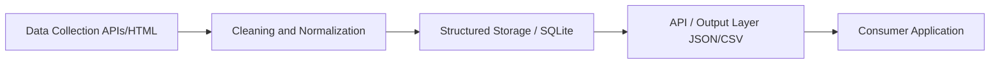

# Ahmedabad Multimodal Transit Data

A verified dataset covering the public transit systems of Ahmedabad — Bus Rapid Transit (BRT), Municipal Bus Service, and the City Metro. Python ETL pipeline normalizing Ahmedabad transit APIs (BRTS, AMTS, Metro) into unified JSON/GTFS datasets for GraphHopper and OpenTripPlanner.


## Table of Contents
- [Overview and Motivation](#overview-and-motivation)
- [Architecture](#architecture)
- [Data Schema](#data-schema)
- [Statistics](#statistics)
- [Installation and Usage](#installation-and-usage)
- [Data Disclaimer](#data-disclaimer)
- [License](#license)
- [Contributing](#contributing)

## Overview and Motivation

This project provides a clean, schema-validated, multimodal transit dataset. It aggregates data from multiple public transit APIs and websites into a unified format suitable for routing engines, data analysis, and frontend applications. The pipeline normalizes stops, routes, sequences, and fares, and cross-references geospatial coordinates with OpenStreetMap.

## Technical Architecture
- **Data Ingestion**: Python scraper using OAuth2 password-grant to fetch route indices, stop sequences, and fare matrices from municipal APIs, checkpointing state to local JSON.
- **Topological Matching**: Aligns transit nodes across BRT, Metro, and municipal bus by cross-referencing OpenStreetMap coordinates.
- **Validation & Export**: Enforces strict JSON Schema validation on stops, routes, and fare matrices to guarantee structural integrity for downstream consumers.

## Architecture



## Data Schema

| Field Name | Type | Description |
|---|---|---|
| `stop_id` | String | Unique identifier for the transit stop |
| `name` | String | Public name of the stop |
| `lat`, `lon` | Float | Coordinates of the stop |
| `route_id` | String | Unique identifier for the route variant |
| `geometry` | GeoJSON | Full path of the route |
| `fare_inr` | Float | Point-to-point fare in INR |

## Statistics

- **Total Stops:** ~3,600+
- **Total Routes:** ~880+
- **Interchange Groups:** ~550
- **Fare Matrix Entries:** ~47,500

## Installation and Usage

Clone the repository and run the build scripts:

```bash
# Setup environment variables for API access
export TRANSIT_API_USER="your_user"
export TRANSIT_API_PASS="your_password"

# Re-build outputs from the committed data/raw/ without re-scraping
python scripts/run_all.py --skip-scrape

# Sample run from scratch (5 routes per agency)
python scripts/run_all.py --sample

# Full run
python scripts/run_all.py
```

## Data Disclaimer

**The data is aggregated from publicly available transit information for informational purposes. This project is not affiliated with or endorsed by any transit operator. Accuracy is not guaranteed and users should confirm time-sensitive details (fares, schedules) through official channels.**

## License

The code in this repository is licensed under the MIT License. See [LICENSE](LICENSE) for details. For data attribution requirements, see [NOTICE](NOTICE).

## Contributing

Please see [CONTRIBUTING.md](CONTRIBUTING.md) for details on how to file issues, branch naming, and PR expectations.
